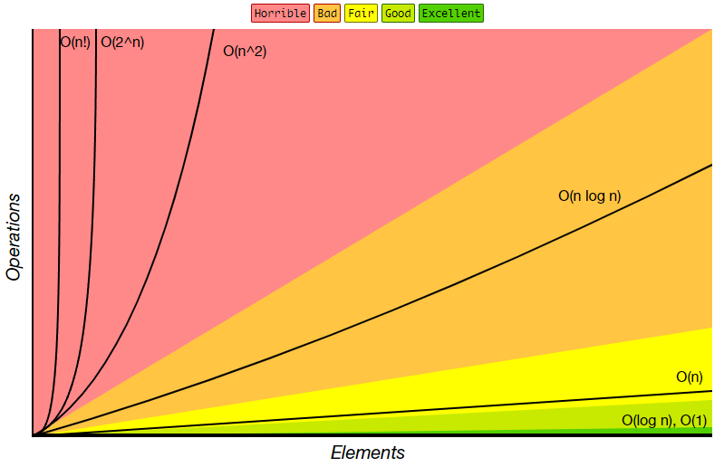
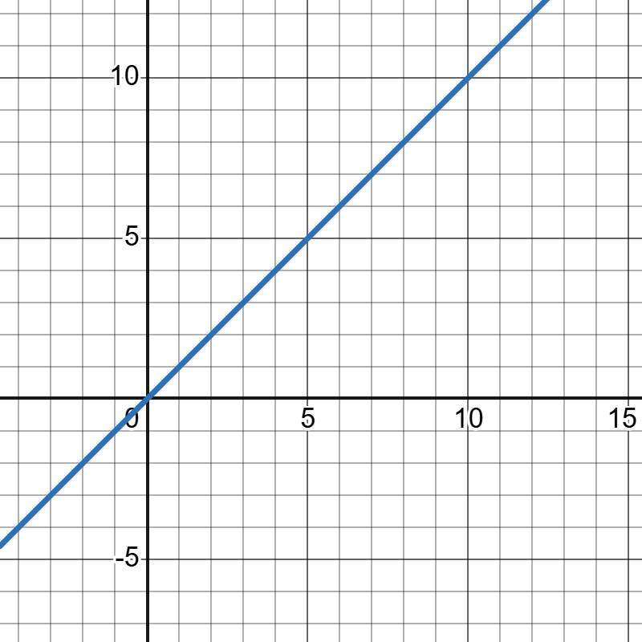
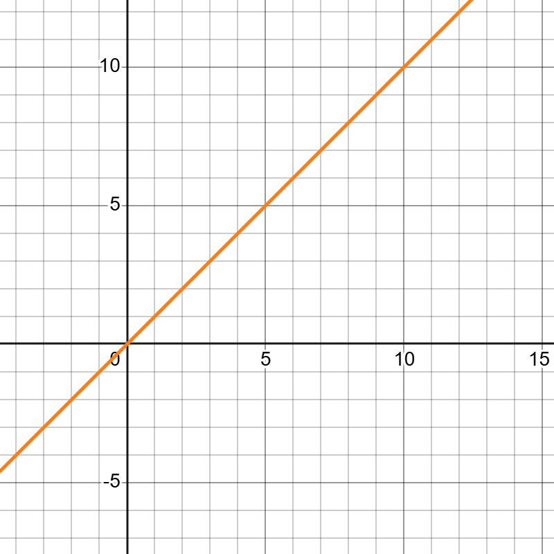
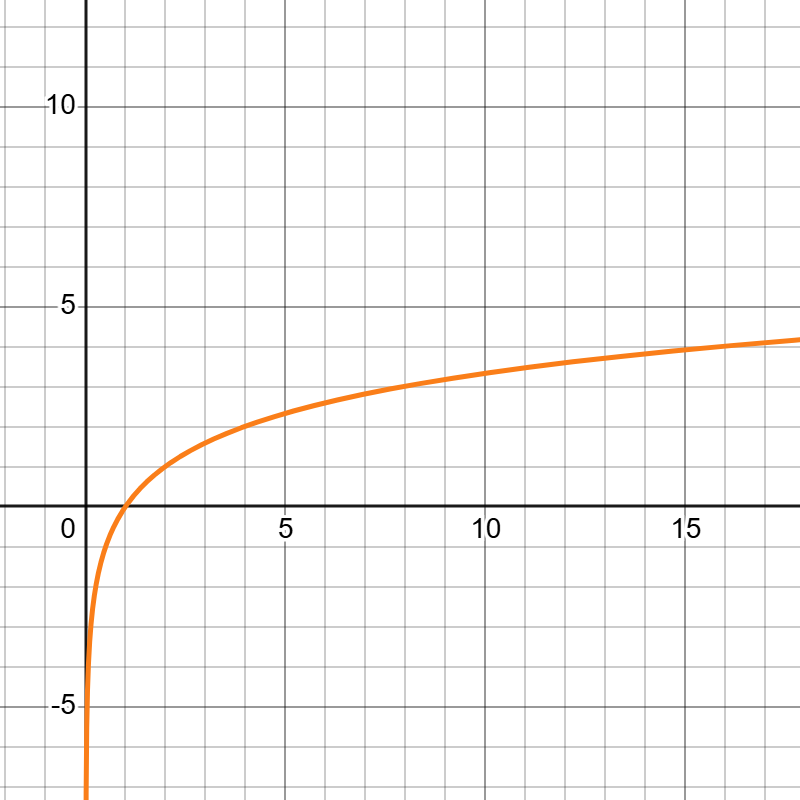

# Atividade B3-3

## Introdução ao BigO

O BigO é uma forma de se representar e analisar o nível de complexidade de códigos, tendo objetivo de identificar a **eficiencia** do determinado código: 

### Funcionamento x Desempenho



Para isso, é necessário que sempre consideremos o pior dos casos na passsagem da utilização do programa, um conceito chamado de Análise Assintótica. Além disso, outro ponto a se considerar é a formação das fórmulas em BigO. Nelas, as constantes são ignoradas, valores simples que não mudam, para que sobrem apenas valores de maior complexidade, que variam.

Para o exercício em questão, considerando serem todos mecanismos de buscas, será necessário a verificação do caso onde o programa não encontra o valor desejado.

### x ∉ A

Além disso, para melhor entendimento e fins didáticos, funções exclusivas e estruturas específicas da linguagem C não serão consideradas pois não é posssível nem necessário que saibamos a quantidade específica de tempos(T) que elas ocupam.

***OBS:*** *n = tamanho do array*

## Busca Linear

```
#include <stdio.h>

int main() {

    int A[] = {40, 80, 10, 20, 30, 50, 70, 60};
    int x = 90;
    int i = 0;

    while (i <= sizeof(A)){

        if(x == A[i]){
            printf("Valor encontrado: %d", A[i]);
          return i;
        }

        i = i + 1;
    }
        printf("Valor não encontrado!");
        return -1;
} 
```

### Análise da contagem de T's do código:

#
* int A[] = {40, 80, 10, 20, 30, 50, 70, 60} - Atribuições - 8t
* int x = 90 - Atribuição - T
* int i = 0: Atribuição - T

**n * (**
  
* i <= sizeof(A): Condição - T
* A[i]: Acesso - T
* A[i] == x: Condição - T
* i + 1: Operação Aritmética - T
* i = i + 1: Atribuição - T

**)**
#

Quando o programa passar por todos os elementos do Array ele verificará uma última vez se *"i <= sizeof(A)"* (adicionando mais um t), e depois irá para o retorno:

* return -1 = Retorno - T

Fórmula: 10t + 5t**n** + t + t = **5tn + 12t**

Porém, como dito anteriormente, para o BigO, apenas os elementos de maior complexidade são considerados para sua avalização. Portanto restando somente ***n***.

## Gráfico resultado de N



## Busca Linear em Ordem

```
#include <stdio.h>

int main() {

    int A[] = {10, 20, 30, 40, 50, 60, 70, 80};
    int x = 90;

    int i = 0;

    while (i <= sizeof(A) && x >= A[i]){

        if(x == A[i]){
            printf("Valor encontrado: %d", A[i]);
          return i;
        }

        i = i + 1;
    }
        printf("Valor não encontrado!");
        return -1;

}
```

### Análise da contagem de T's do código:

#
* int A[] = {10, 20, 30, 40, 50, 60, 70, 80} - Atribuições - 8t
* int x = 90 - Atribuição - T
* int i = 0: Atribuição - T

**n * (**
  
* i <= sizeof(A): Condição - T
* A[i] - Acesso - T
* x >= A[i] - Condição - T
* A[i]: Acesso - T
* A[i] == x: Condição - T
* i + 1: Operação Aritmética - T
* i = i + 1: Atribuição - T

**)**
#

Quando o programa passar por todos os elementos do Array ele verificará uma última vez se *"i <= sizeof(A)"* (adicionando mais um t). Um detalhe deste caso é que ao programa já verificar que a primeira condição não é verdadeira, ele não realizará a segunda 
**x >= A[i]**, encaminhando a lógica para o retorno:

* return -1 = Retorno - T

Fórmula: 10t + 7t**n** + t + t = **7tn + 12t**

Porém, como dito anteriormente, para o BigO, apenas os elementos de maior complexidade são considerados para sua avalização. Portanto restando somente ***n***.

## Gráfico resultado de N



## Busca Binária

```
#include <stdio.h>

int main() {

    int A[] = {10, 20, 30, 40, 50, 60, 70, 80};
    int x = 90;

    int meio;
    int esq = 0;
    int dir = sizeof(A);

    while (esq <= dir){

        meio = (esq + dir) / 2;

        if(x == A[meio]){
            printf("Valor encontrado: %d", A[meio]);
          return meio;
        }
        else if(x > A[meio]){
            esq = meio + 1;
        }
        else{
            dir = meio - 1;
        }

    }
        printf("Valor não encontrado!");
        return -1;
}
```

### Análise da contagem de T's do código:

#
* int A[] = {10, 20, 30, 40, 50, 60, 70, 80} - Atribuições - 8t
* int x = 90 - Atribuição - T
* int meio - Atribuição - T
* int esq = 0: Atribuição - T
* int dir = sizeof(A) - Atribuição - T

**log₂(n) * (**
  
* esq <= dir: Condição – T
* esq + dir: Operação Aritmética – T
* (esq + dir) / 2: Operação Aritmética – T
* meio = (esq + dir) / 2: Operação Aritmética – T
* A[meio]: Acesso – T
* A[meio] == x: Condição – T
* A[meio]: Acesso – T
* x > A[meio]: Acesso – T

* Adição de 2T por:  
  * meio – 1: Operação Aritmética – T
  * dir = meio – 1: Atribuição – T
  * OU ----------------------
  * meio + 1: Operação Aritmética – T
  * esq = meio + 1: Atribuição – T

**)**
#

Quando o programa passar por todos os elementos do Array ele verificará uma última vez se o **esq <= dir**, e depois irá para o retorno: 

* return -1 = Retorno - T

Fórmula: 12t + 10t**log₂(n)** + t + t = **10t * log₂(n) + 14t**

Porém, como dito anteriormente, para o BigO, apenas os elementos de maior complexidade são considerados para sua avalização. Portanto restando somente ***log₂(n)***.

## Gráfico resultado de N


